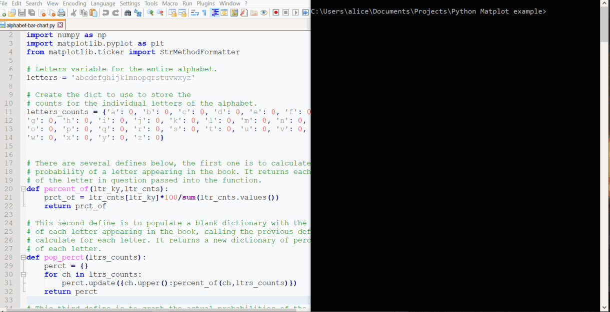

# Python_matplot_novel
This is a simple python application for graphing a novel, to represent the general probabilities of a letter appearing in each novel, thus graphing the prevalence of each letter in the English language.

Users can select between four novels, or they can pick their own novel from the <a href='http://www.gutenberg.org/'>Gutenberg library</a>, by copying the URL of the plain text UTF-8 text version of said novel into the program. After which the program will prompt the user for which option they wish to use with the novel in question, to find the probability of a certain letter in the novel, graph all the letter probabilities in the novel, save a copy or exit the program.  The gif above demonstrates the program working using Jules Verne’s <a href='http://www.gutenberg.org/cache/epub/164/pg164.txt'>Twenty Thousand Leagues under the Sea</a>, and it will run with any novel available on Gutenberg in plain text. Below is a sample of the main four novels the program can graph on default.

